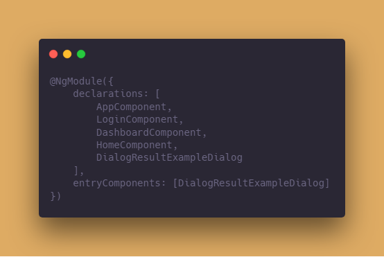

# Angular 常见问题解答

1. ng6, TypeError: _this._driver.validateStyleProperty is not a function
> 把@angular/animations 升级/降级到 6.0.5就好了

2. Uncaught (in promise): Error: Type is part of the declarations of 2 modules:
> 重复声明了，删除一个就行了

3. zorro 0.7 对应 rxjs5 + less2
> zorro1.* 可以搭配ng6使用，注意版本

4. 解决了tslint报错，错误提示依然存在
> 删掉报错部分，重新录入就可以了

5. file is not a module angular
> 包没有引对，重启一下项目，根据报错排查排查

6. nzPageSize="pageSize" 和 [nzPageSize]="pageSize"的区别
> 前者为赋值，后者为属性绑定

7. Can't bind to 'ngModel' since it isn't a known property of ...
> Template-driven表单没有引入FormModule

8. StaticInjectorError(AppModule) 静态注入错误
NullInjectorError: No provider for ...
> 依赖注入报错，需要在对应的component, module的元数据中加入providers: [服务名]

9. Can't bind to 'formGroup' since it isn't a known property of 'form' 
> 使用Reactive Form却没有引入相应模块

10. rxjs 从5升级到compat，再到6，import 操作符报错
> 引入路径发生了较大变化，要多查查官网示例，例如在在rxjs6中，import { map } from 'rxjs/operators';

12. Property 'http' does not exist on type...
> ng5之后，要引入httpClientModule，并且注入httpClient服务才能使用网络服务

13. ERROR Error: No component factory found for * . Did you add it to @NgModule.entryComponents? -angularjs
> 使用场景：add dynamically created components to entryComponents inside your @NgModule 动态创建组件；在父级组件中的元数据配置一下即可，如下； 
 
In some cases entryComponents under lazy loaded modules will not work,
as a workaround put them in your app.module (root)
在懒加载模块中可能不会生效

14. Error: ExpressionChangedAfterItHasBeenCheckedError: Expression has changed after it was checked.
> change detect造成了，所以可以从这方面处理，使用onpush + changeDetectRef

15. npm uninstall -g @angular/cli not work ---> 命令行提示up to date
> 安装指定版本cli, 则直接覆盖了原来的，cli全局版本高于本地版本也可以跑，推荐使用npx来安装

16. npm warn registry unexpected warning for https
> 1. npm cache clear --force 卸载cli之后，一定要清理npm缓存
> 2. 删除node_modules文件夹
> 3. 删除package-lock.json文件
> 4. npm install/yarn即可

17. 安装node-sass出错
> sass被墙了，
> 1. npm config set sass_binary_site https://npm.taobao.org/mirrors/node-sass/
> 2. npm install --save-dev node-sass

18. 接手别人的项目怎么最快的把项目跑起来？
> 1. 确保OS, node, npm, ng的版本 例如sass需要ruby环境中编译
> 2. 删除package-lock.json文件，然后npm cache verify/npm cache clear --force 清除缓存
> 3. 把项目（带上node包）的文件copy过来，直接本地跑

19. Failed at the phantomjs-prebuilt install script 'node install.js'
npm安装phantomjs不成功，咋整？
> 老版本的都没有办法 😞，弃了

20. 使用loadChildren实现懒加载的时候，一切都似乎配置正确，但是页面上似乎没有显示内容
> 懒加载的模块中，路由配置为path: ''

21. response.json is not a function 
> Angular2 之后的版本中Http Client模块中已经默认调用了res.json()方法了，不需要手动调用
new http client by default calls res.json() implicitly and you don't need to that manually yourself

22. component中变量的值改变了，对应视图上没有刷新
> 1. 元数据中配置changeDetection: ChangeDetectionStrategy.OnPush
> 2. 依赖注入private cdr: ChangeDetectorRef
> 3. 调用cdr.markForCheck()方法 ---> 告知angular执行change detection

 未完待续...
