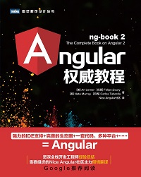

# 史上最全Angular资料汇总

📄 A curated list of awesome... 多么熟悉的开头，感觉瞬间:scream:，
标题党了有木有，我尽量把列漏掉的Angular中文学习资料贴出来，英文资料:point_right:[awesome-angular](https://github.com/PatrickJS/awesome-angular)

> VTHINKXIE所写的[Angular资料获取不完全指南](https://zhuanlan.zhihu.com/p/36385830)和Angular官网的[资源](https://angular.cn/resources)基本已经覆盖了大部分的资料，本文仅作为补充

目录
- [Angular](#angular)
  - [书籍](#ng书籍)
- Material Design
- Typescript
- Rxjs
- Ngrx
- Ionic

### Angular

> Angular is a development platform for building mobile and desktop web applications.

#### ng书籍
- Angular权威教程
>  
> 应该是中文唯一值得看的ng书籍了，偏基础，非常适合入门，其中讲数据架构的那一章很精彩 
> 推荐指数：:star::star::star::star::star:
