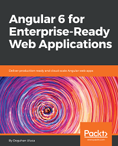

# 史上最全Angular资料汇总

📄 A curated list of awesome... 多么熟悉的开头，感觉瞬间:scream:，
标题党了有木有，我**尽量**把列漏掉的Angular中文学习资料贴出来，英文资料:point_right:[awesome-angular](https://github.com/PatrickJS/awesome-angular)

> VTHINKXIE所写的[Angular资料获取不完全指南](https://zhuanlan.zhihu.com/p/36385830)和Angular官网的[资源](https://angular.cn/resources)基本已经覆盖了大部分的资料，本文仅作为补充

目录
- [Angular](#angular)
  - [书籍](#ng书籍)
  - [gitchat](#ng-gitchat)
  - [视频教程](#ng视频教程)
  - [论坛/钉钉/QQ群](#ng社交媒体)
- Material Design
  - [文档/博文]()
  - [demo/seed project]()
- Typescript
- Rxjs
  - [文档/博文]()
- Ngrx
- Ionic

### Angular

> Angular is a development platform for building mobile and desktop web applications.

#### ng书籍
- Angular权威教程
>  
> 应该是中文唯一值得看的ng书籍了，基于ng2，偏基础，非常适合入门，其中讲数据架构的那一章很精彩(英文版已经出了ng6的版本:smirk:) 
> 推荐指数：:star::star::star::star::star:

 

- Angular 6 for Enterprise-Ready Web Applications
>  
> 由Packt出版社出版(这家关注于IT电子书出版，书一般都偏向实操类的)，这本书通过两个例子，详细地讲解了ng开发的方方面面，可以从中学习到很多开发技巧和ng开发知识，例如怎么换ng项目的favicon，需要注明版本`href="favicon.ico?v=2"`，
> 还有怎么编写测试代码，使用Angury的技巧等等 
> 推荐指数：:star::star::star::star:(非中文，所以少一颗芯)

 

- Angular Design Patterns
>  
> Packt出版社出版，全书基于ts来实现Angular中的一些设计模式，如单例模式，工厂模式，跟讲ts设计模式的文章可能有会一些重合，用简单的ts代码来实现最小的**观察/订阅模式**, **MVC模式**等，还有点小激动:heart_eyes: 
> 推荐指数：:star::star::star::star:(非中文，所以少一颗芯)

 

#### ng gitchat
- Angular 初学者快速上手教程
>  
> 由前端恶棍，喔:sweat_smile:，不是，大漠老师倾情出品，整个chat基于ng5, 非常精炼，指出了初学者可能遇到的一些坑，提供了示例代码，值得反复看一看 
> 推荐指数：:star::star::star::star:(毕竟太短了，不要被打:cold_sweat:)

 

- Angular 基础教程（7.0）
-  
- 还是那个大漠老师，心疼他的发量:grin:，，这个我没卖，不过看简介，应该融入了新特性
- 推荐指数：待定

 

- Ionic 3 实战开发指南
>  
> 这个老叔的gitchat给我最大的印象是花了很大的篇幅来讲怎么写测试代码 
> 推荐指数：:star::star::star:(使用cordova的ionic比不了RN, 连新晋的flutter...，要离坑喽)

 

#### ng视频教程
- [Angular 4.0从入门到实战 打造股票管理网站](https://coding.imooc.com/class/94.html)
- [Angular 打造企业级协作平台](https://coding.imooc.com/class/123.html)
> 前者偏向入门，把ng的基本点路由，组件，服务等都覆盖到了，后者偏向进阶，讲清楚了包括自定义拖拽指令，rxjs常用操作符，redux状态管理等 
> 推荐指数：:star::star::star:(视频1.5倍速，感觉效率还是不如纸质资料，尽管能看到编程细节，这里有我个人偏向性)

 

#### ng社交媒体
- 各个repo的issue区
- 钉钉群
  - Ng zorro
    >  
    > Ng-zorro已经成为了Angular最受欢迎的UI库之一，被很多前端兄弟们用到了公司项目中去，这个钉钉群里面有作者和他的团队来答疑解惑，很值得加入
  - Ng Zorro mobile
- QQ群(为什么没有ng的微信群？)
