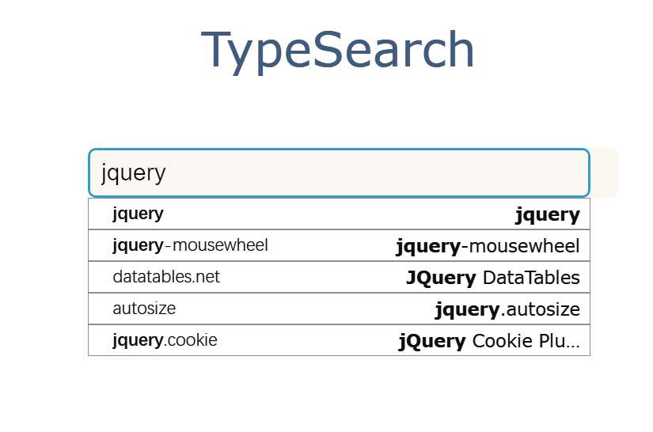
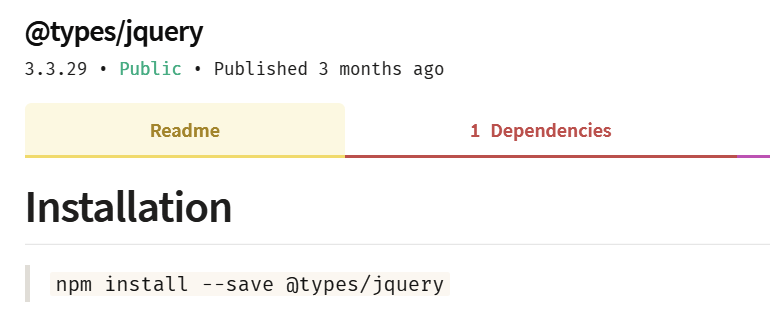

# Angular中如何引入第三方库

 

## 前言
---
在Angular中，typescript是作为一等公民存在的，而在ts中使用第三方库的时候，Type Definition File是绕不过去的。但是ts官方和社区只对流行的一些库编写了类型声明文件，如果有类型声明文件怎么用起来？要是没有:fearful:，怎么写？卡色大佬的[Angular 如何使用第三方库](3)很有条理地讲清楚了以上两个问题，我也不做多余的赘述，所以本文主要从实际的demo入手，叫你一步，两步...,像魔鬼的步伐:stuck_out_tongue_winking_eye:

 

## 必要性
---
> Declaration files, if you're not familiar, are just files that describe the shape of an existing JavaScript codebase to TypeScript. By using declaration files (also called .d.ts files), you can avoid misusing libraries and get things like completions in your editor. --- From Microsoft Devblogs

提炼一下如下：
- 提供类型声明，避免库的误用
- 编辑器的补全功能(效率神奇:rocket:)

 

## 如何引入第三方库
---
1. 检查有没有@types/文件
> 在[TypeSearch](6)(实际上，TypeSearch的数据来源于[DefinitelyTyped](4))去搜索一下包的关键词，例如下图：
> {:height="50%" width="50%"}
> {:height="50%" width="50%"}
2. 有@types/文件情况下引入且使用

3. 没有@types/文件情况下，怎么引入和使用 

 

### 参考文档
---
1. https://www.typescriptlang.org/docs/handbook/declaration-files/consumption.html
2. https://devblogs.microsoft.com/typescript/writing-dts-files-for-types/
3. https://zhuanlan.zhihu.com/p/35796451
4. https://github.com/DefinitelyTyped/DefinitelyTyped/tree/master/types
5. https://www.detroitlabs.com/blog/2018/02/28/adding-custom-type-definitions-to-a-third-party-library/
6. https://microsoft.github.io/TypeSearch/
