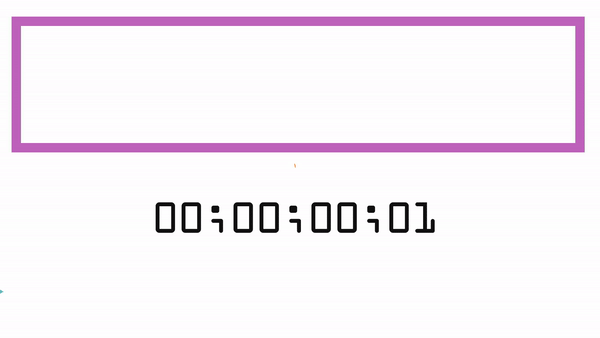

# 20个实际小栗子入门rxjs - 大概是最简单了吧...:smirk:

在这个教程中，我将用20步来讲解Rxjs ( Reactive extensions for Javascript)的基础知识，覆盖关键点，而不会去cover所有的operator, class。确实会比较简单
> 本教程基于Rxjs 6.4.0<br/>
> Demo<br/>
> 源码<br/>

### 1. Rxjs是啥？
思考的角度很多，对于我来说，Rxjs是...<br/>
... 一个能处理异步事件流的工具<br/>
... 像JS 函数式编程，但是加入了时间的维度
... 像一个能够不断resolve的Promise



<br/>

### 2. 创建Observables，定义流
在Rxjs看来，一切皆是流。而创建流，则需要用创建类的操作符，
2.1 使用create操作符
最常用的是Observable.create()方法，subscriber可以通用next()方法来获取Observabel发射的值，
示例如下:
```
const observalbe = Observalbe.create(observer => {
    observer.next('hello');
    observer.next('world');
    observer.error('something wrong!');
    observer.complete();
});

// 这里接受了next()方法
observable.subscribe(val => console.log(val));
```

2.2 使用了fromEvent把事件转化为stream
示例如下：
```

```

<br/>

### 3. 

<br/>

### 外部资源：
